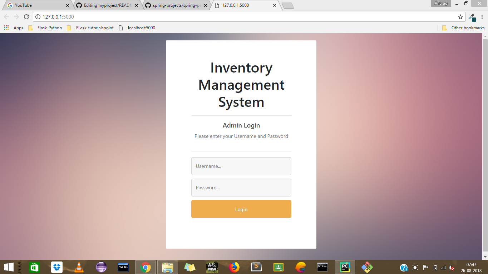
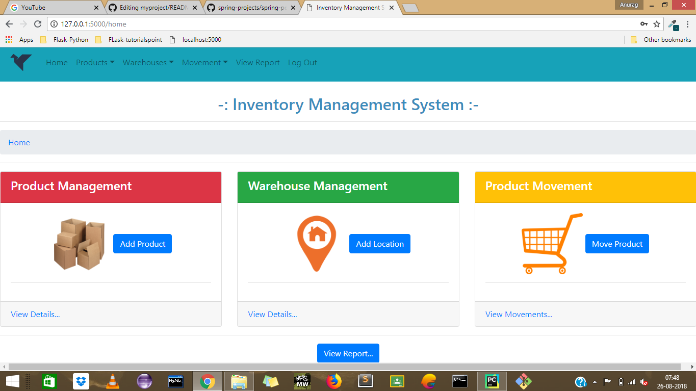
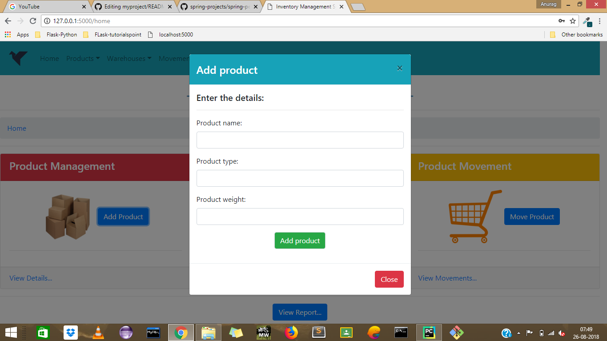
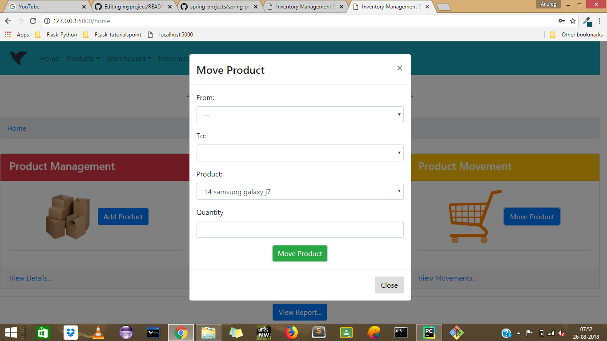
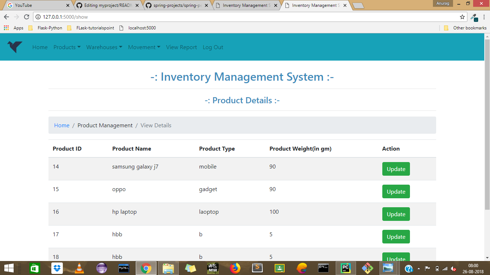
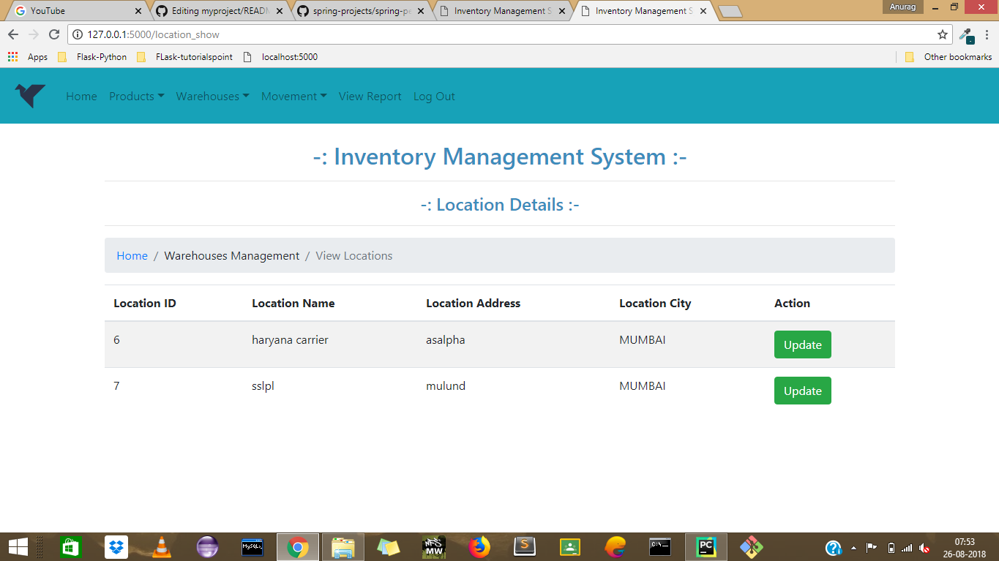
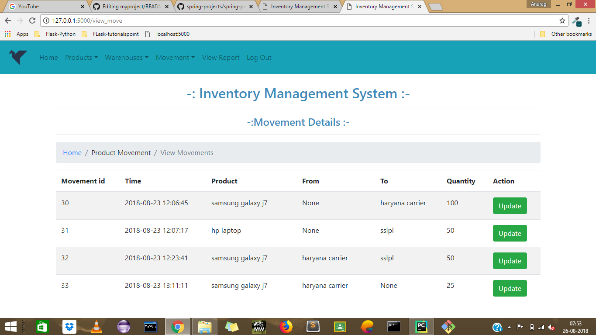
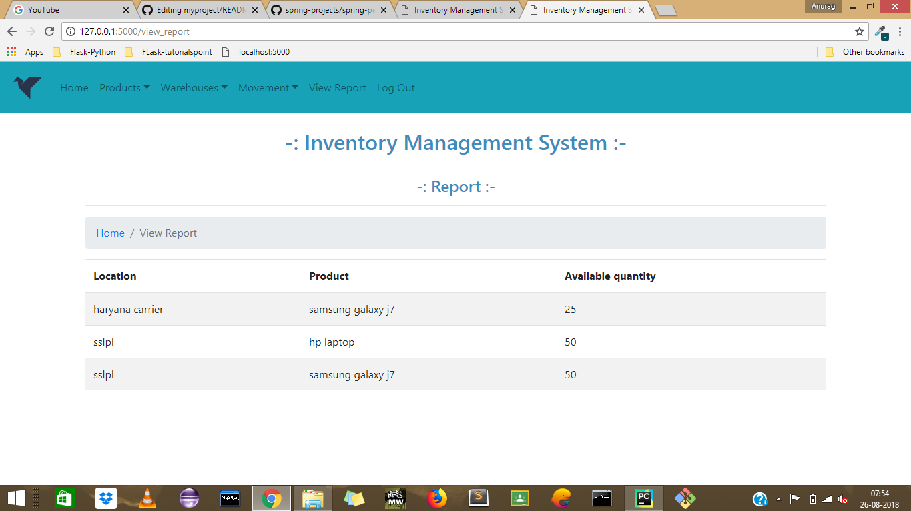

# product_inventory
### The product is being developed to track real time movement of products from one location to another.

## prerequisites:
The following items should be installed in your system:

1. Pycharm IDE
2. MySql Database server

## Add following Intepreter

1. Flask
2. jinja2
3. mysql-connector-python(for Database Connection)
4. Flask-Session

## Commands used

    //for creating virtual venv
    pip virtualenv venv

    //for installing Flask
    pip install Flask

    //for installing jinja2 templates
    pip install jinj

    //for installing mysql connector
    pip install mysql-connector-python

# PAGES
## 1. Login Page

## 2. Home Page

## 3. Add Product modal

## 4. Add Location modal

## 5. Move Product modal

## 6. View and Update product details 

## 7. View and Update location details 

## 8. View and Update product Movements details 

## 7. View final report 

 #### GIT Commands:
 
    git pull
    git status
    git add .
    git commit -m "any message"
    git push
    git push  --set-upstream origin branch_name
